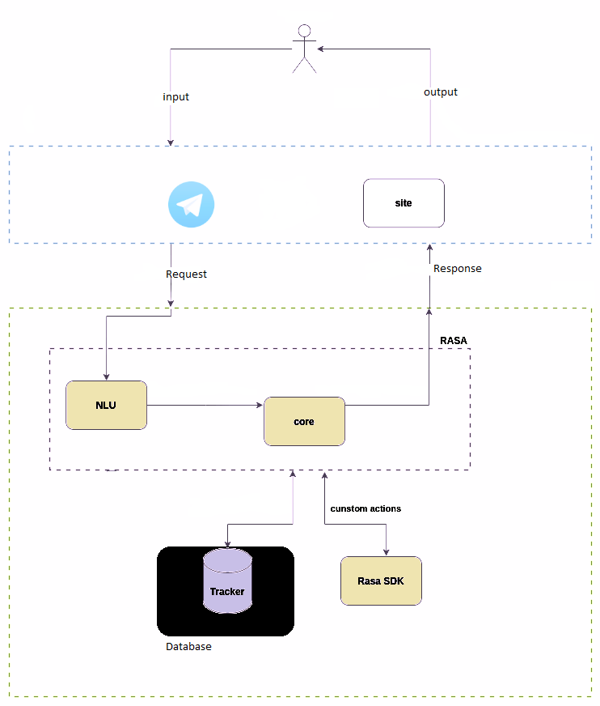
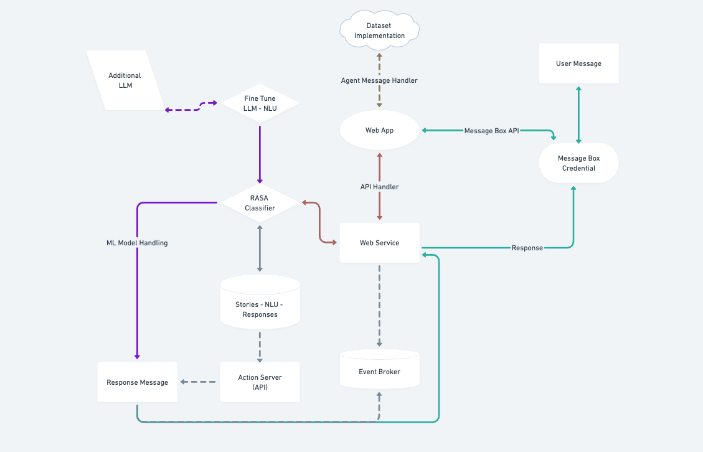

# Example Bot

This is a sample retail bot to help provide starter content, examples of how to implement particular features, and sample use cases. Built using Rasa 3.2

## Install dependencies

Run:
```bash
pip install -r requirements.txt
```
to Change runnin project to use arabic anly download fast-text Arabic models: [Arabic](https://dl.fbaipublicfiles.com/fasttext/vectors-crawl/cc.ar.300.bin.gz), [Arabic Egypt](https://dl.fbaipublicfiles.com/fasttext/vectors-crawl/cc.arz.300.bin.gz) into vecs folder with exract the archive of downloaded gz file
create vecs folder in dosen`t created, if you cant chang the config file you should take a look on the recources that i was added it 
note that you could change fast-text model with models into fast-text or another that defined in reading list, so check config.yml 

- name: rasa_nlu_examples.featurizers.dense.FastTextFeaturizer
     cache_path: vecs/cc.ar.300.bin

  for model customization and model path configurations as defined in config.yml

     [example](https://rasa.com/blog/enhancing-rasa-nlu-with-custom-components/)
### install python env
python venv with version <3.8, python >3.6 and [rasa_nlu_examples](https://github.com/RasaHQ/rasa-nlu-examples)
find fast-text module for rasa
### working with chat platforms 
to configure the model to answer as a bot on telegram bot channel created channel then put bot name and auth token into cradentials.yml
with webhooks examples go to [ngrok](https://ngrok.com/) webhook -- domain then create new run it into your machine
note that rasa working with local port 5005
### Issues
if you working with external models you should make installations og packages with these steps for avoid the error:
  - using git or download https://github.com/RasaHQ/rasa-nlu-examples 
  - install make from [Here for windows](https://linuxhint.com/install-use-make-windows/) , [Here for linux](https://www.geeksforgeeks.org/how-to-install-make-on-ubuntu/) [for mac](https://formulae.brew.sh/formula/make)
  - make install
To get started locally you can run:
```
python -m pip install -e ".[dev]"
pre-commit install
python tests/scripts/prepare_fasttext.py
```
- Alternatively you may also run this via the Makefile:
```
make install
```


## Run the bot

Use `rasa train` to train a model.
```bash
  rasa run -m models --enable-api --cors "*" --debug
```
Then, to run, first set up your action server in one terminal window:
```bash
rasa run actions
```

In another window, run the duckling server (for entity extraction):
```bash
docker run -p 8000:8000 rasa/duckling
```

Then talk to your bot by running:
```
rasa shell --debug
```

Note that `--debug` mode will produce a lot of output meant to help you understand how the bot is working
under the hood. To simply talk to the bot, you can remove this flag.


## 🧪 Testing
- Train bot
```
rasa train
```
- Test bot on shell
```
rasa shell
```
- start `rasa` server
```bash
rasa run --enable-api --cors "*" --debug[Optional] -p {PORT}[optional]
```
- start `actions` server
```
rasa run actions -p {PORT}[Optional]
```
## Overview of the files

`data/stories.yml` - contains stories

`data/nlu.yml` - contains NLU training data


`data/rules.yml` - contains the rules upon which the bot responds to queries

`actions/actions.py` - contains custom action/api code

`domain.yml` - the domain file, including bot response templates

`config.yml` - training configurations for the NLU pipeline and policy ensemble

`tests/test_stories.yml` - end-to-end test stories

____________________________________________________________________________________________________________
rasa project works with telegram, to know more about its [API](https://medium.com/devops-dev/free-hosting-for-your-telegram-bot-its-easier-than-you-think-66a5e5c000bb)

## 🛠 Features {Changable}
- [x] Basic
- [x] Basic chitchats
- [x] Out of Scope
- [x] Contact us form
- [] Send Emails
- [] Adding open AI
- [x] chat with bot via multi channels 
- [] make a handoff 
- [] creating a customer feedback
- [x] all chat stored 
- [] make a api with LLM if open AI key not defiend

## Things you can ask the bot

1. Check the status of an order [X]
2. Return an item [X]
3. Cancel an item [X]
4. Search a product inventory for shoes [X]
5. Subscribe to product updates [X]

The bot can handle switching forms and cancelling a form, but not resuming a form after switching yet.

The main flows have the bot retrieving or changing information in a SQLite database (the file `example.db`). You can use `initialize.db` to change the data that exists in this file.

For the purposes of illustration, the bot has orders for the following email addresses:

- `example@rasa.com`
- `me@rasa.com`
- `me@gmail.com`

And these are the shoes that should show as in stock (size, color):

```
inventory = [(7, 'blue'),
             (8, 'blue'),
             (9, 'blue'),
             (10, 'blue'),
             (11, 'blue'),
             (12, 'blue'),
             (7, 'black'),
             (8, 'black'),
             (9, 'black'),
             (10, 'black')
            ]
```

## Testing the bot

You can test the bot on test conversations by running  `rasa test`.
This will run [end-to-end testing](https://rasa.com/docs/rasa/user-guide/testing-your-assistant/#end-to-end-testing) on the conversations in `tests/test_stories.yml`.

Note that if duckling isn't running when you do this, you'll see some failures.

## Action Server Image

You will need to have docker installed in order to build the action server image. If you haven't made any changes to the action code, you can also use
the [public image on Dockerhub](https://hub.docker.com/repository/docker/cdesmar/retail-demo) instead of building it yourself.

It is recommended to use an [automated CI/CD process](https://rasa.com/docs/rasa/user-guide/setting-up-ci-cd) to keep your action server up to date in a production environment.


## :gift: License
Licensed under the GNU General Public License v3. 
There is no warranty for the project runs.



